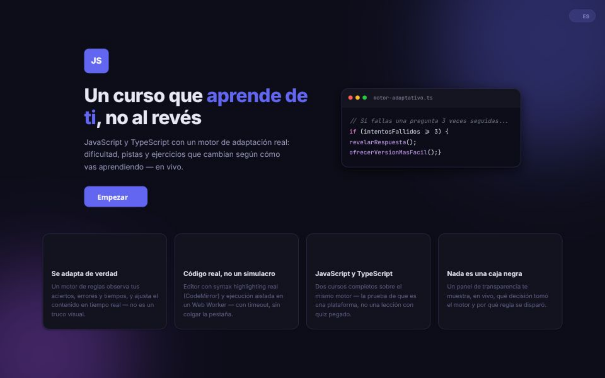
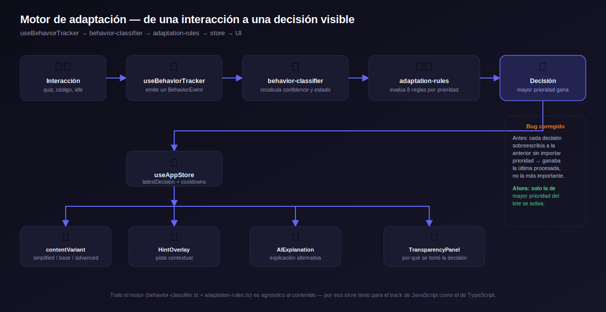

# JS Adaptive Learning

[](https://github.com/Cristian910/Adaptative-learning/actions/workflows/ci.yml)


### 🔗 [Ver demo en vivo](https://adaptative-learning.vercel.app/)



Curso interactivo de **JavaScript y TypeScript** con un motor de adaptación
real: el contenido, la dificultad y las pistas se ajustan en tiempo real
según cómo va aprendiendo cada persona. No es una animación ni un efecto
visual — es un sistema de reglas que observa aciertos, errores y tiempos, y
decide en consecuencia, con un panel que hace esa decisión visible y
explicable en cualquier momento.

## Características

- **Motor de adaptación real**: clasifica el comportamiento del usuario
  (aciertos, errores, tiempos de respuesta, inactividad) y ajusta
  dificultad, densidad de contenido y pistas mediante un sistema de reglas
  con prioridades — no es aleatorio ni cosmético.
- **Dos cursos completos sobre el mismo motor**: JavaScript (10 lecciones) y
  TypeScript (5 lecciones), con selector de curso y nivel de inicio.
- **Editor de código real**: syntax highlighting, autocompletado y
  ejecución aislada en un Web Worker con timeout — un ejercicio con loop
  infinito nunca cuelga la pestaña.
- **Quiz adaptativo**: revela la respuesta y ofrece una versión más simple
  tras fallar la misma pregunta varias veces, en vez de dejar a alguien
  trabado indefinidamente.
- **Panel de transparencia**: muestra en vivo qué decisión tomó el motor y
  por qué regla se disparó — nada actúa como caja negra.
- **Gamificación con propósito**: puntos, racha, rangos y logros atados a
  progreso real, más un examen final para certificar conocimiento previo
  sin tener que recursar contenido ya dominado.
- **Certificado descargable**, dashboard de progreso con gráficos, sección
  de práctica libre (playground) y sistema de repaso de lo que se falló.
- **Modo claro/oscuro** y **selector de idioma** (español/inglés) en toda la
  interfaz.
- **Accesible**: focus trap en modales, navegación por teclado, roles ARIA
  y anuncios `aria-live` para lectores de pantalla.
- **PWA instalable** que funciona offline después de la primera visita.
- **186 tests** (unitarios, de integración, de componentes y E2E) y CI en
  GitHub Actions.

## Cómo funciona el motor adaptativo



El motor **no sabe nada sobre JavaScript ni TypeScript específicamente** —
por eso el mismo código sirve para ambos cursos sin ningún cambio. El
pipeline completo, de una interacción a una decisión visible:

1. **`useBehaviorTracker`** captura cada interacción (respuesta de quiz,
   corrida de código, inactividad) como un evento de comportamiento.
2. **`behavior-classifier`** recalcula un nivel de confianza (un promedio
   ponderado que pesa más lo reciente) y el estado del alumno.
3. **`adaptation-rules`** evalúa un conjunto de reglas independientes contra
   ese estado y produce decisiones de adaptación, cada una con una
   prioridad.
4. Solo la decisión de **mayor prioridad** del lote se activa.
5. Esa decisión llega al store y reactiva la interfaz: cambia la variante de
   contenido, muestra una pista, dispara una explicación alternativa, o
   queda reflejada en el panel de transparencia para que sea demostrable.

## Stack tecnológico

- **React 18** + **TypeScript** (modo estricto) + **Vite**
- **Zustand** para el estado global
- **Framer Motion** para animaciones
- **CodeMirror 6** para el editor de código
- **Recharts** para el dashboard de progreso
- **Sucrase** para ejecutar código TypeScript en el navegador (le quita los
  tipos antes de correrlo en el Web Worker)
- **Vitest** + **React Testing Library** para tests unitarios/de componentes
- **Playwright** para tests E2E
- **vite-plugin-pwa** para la app instalable

## Estructura del proyecto

```
src/
├── app/              # Layout principal, providers (tema, idioma), routing
├── engine/           # Motor de adaptación: clasificador y reglas
├── features/
│   ├── lesson/
│   │   ├── components/   # UI: quiz, editor de código, dashboard, etc.
│   │   ├── data/          # Contenido de las 15 lecciones (JS + TS)
│   │   ├── hooks/         # useBehaviorTracker, useLessonProgress, etc.
│   │   └── utils/         # Ejecución de código, i18n de decisiones
│   └── gamification/  # Puntos, rangos y logros
├── i18n/             # Diccionario de strings (español/inglés)
├── services/ai/      # Integración opcional con OpenAI
├── store/            # Estado global (Zustand)
├── test/             # Tests unitarios, de integración y de componentes
└── types/            # Tipos compartidos del dominio
e2e/                  # Tests end-to-end (Playwright)
docs/                 # Diagrama de arquitectura
```

## Empezar

Requiere [Node.js](https://nodejs.org/) 18 o superior.

```bash
git clone https://github.com/{usuario}/{repo}.git
cd {repo}
npm install
npm run dev
```

Abre la URL que muestra la terminal (normalmente `http://localhost:5173`).

### Configurar la IA (opcional)

El proyecto funciona completo sin ninguna configuración adicional: cuando no
hay una key de OpenAI configurada, las pistas y explicaciones alternativas
caen a contenido de respaldo en vez de generarse con IA. Si más adelante
querés activarlas:

1. Copia `.env.local.example` a `.env.local`.
2. Agrega tu key en `VITE_OPENAI_API_KEY`.
3. Reinicia `npm run dev`.

> Nota de seguridad: con esta configuración, la key queda embebida en el
> bundle que llega al navegador — sirve para desarrollo local, pero no para
> producción pública. Para eso, usa el proxy de ejemplo en `/server` (ver
> `server/README.md`), que mantiene la key del lado del servidor.

## Scripts disponibles

```bash
npm run dev         # servidor de desarrollo
npm run build       # type-check + build de producción a /dist
npm run test        # tests unitarios/de componentes con Vitest
npm run test:watch  # tests en modo watch
npm run test:e2e    # tests E2E con Playwright (requiere: npx playwright install)
```

## Testing

186 tests entre unitarios, de integración, de componentes (React Testing
Library) y de contenido — estos últimos ejecutan de verdad la solución de
referencia de cada ejercicio de código contra su resultado esperado, y
validan que ninguna pregunta de quiz tenga la respuesta correcta
sobre-concentrada en una sola opción. Los tests E2E (Playwright) cubren el
flujo completo de onboarding, el quiz adaptativo y el dashboard.

## Roadmap

- [ ] Generación de ejercicios de código y preguntas a medida del error
      específico del usuario, con IA (pendiente de una alternativa viable a
      la API de OpenAI para uso en producción).
- [ ] Series de tiempo reales en el dashboard (evolución de la confianza a
      lo largo del curso).

## Licencia

[MIT](LICENSE)
